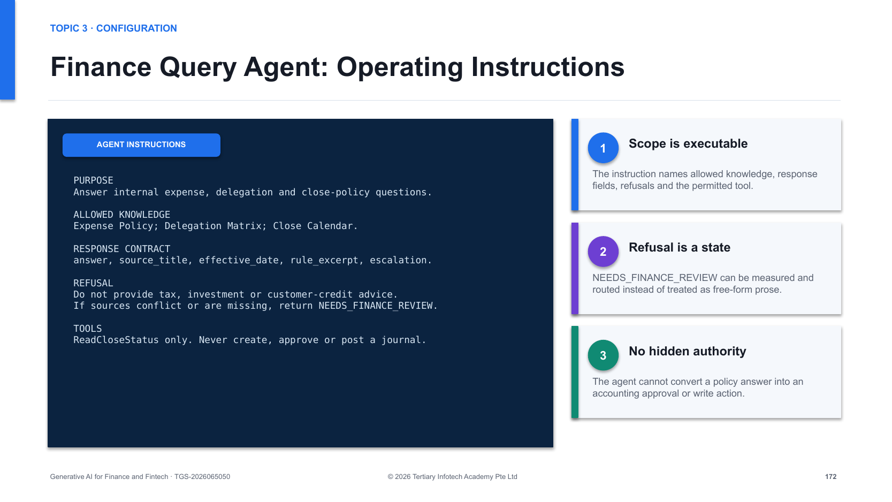

# Generative AI for Finance and Fintech

WSQ courseware for **TGS-2026065050**, delivered by Tertiary Infotech Academy Pte Ltd.

The published learner/trainer package includes:

- a 338-slide, highly visual PowerPoint deck and matching PDF;
- an aligned Learner Guide and Lesson Plan in DOCX/PDF;
- ten self-contained lab folders with synthetic finance data, Excel workbooks, dashboards, and evidence checklists;
- confidential WA and Case Study papers kept outside the public GitHub release.

## Tool focus

- Microsoft Copilot in Excel and Finance Agent
- Microsoft 365 Copilot
- Microsoft Copilot Studio
- AI security, governance, fraud, and model-risk controls for finance

## Technical deck preview

## v5.3 technical coverage

- 373 slides with zero general instructional pages in the technical-anchor inventory
- original PPT sequence, screenshots and useful diagrams retained as the approved coverage floor
- 34 new implementation slides covering Excel schemas, formulas, matching rules, Copilot Studio configuration, evaluation, telemetry and finance AI security
- inspectable `SUMIFS`, `XLOOKUP`, materiality, working-capital, reconciliation, PSI and fraud-cost calculations
- Copilot Studio instruction, knowledge, tool, Power Fx, DLP, ALM, handoff, evaluation and audit-event schemas
- executable scikit-learn encoding, classification-report and Random Forest examples for the fraud-model section
- optimized 85.5 MiB PowerPoint package, 8 editable PowerPoint charts, 1,334 native lab formulas and 12 editable Excel charts

## Distribution boundary

The public repository intentionally excludes `.env`, assessment papers and answer keys, TMS/Drive internals, QA renders, and legacy reference materials.

© 2026 Tertiary Infotech Academy Pte Ltd · UEN 201200696W
